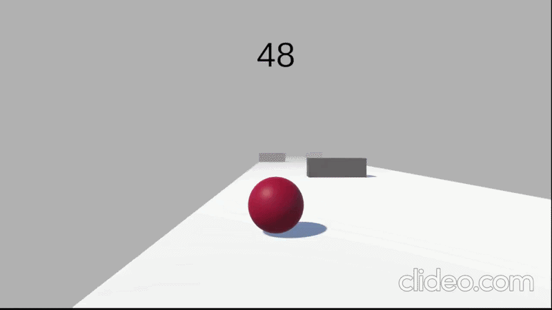

# Velocity Run: Physics-Based Locomotion & Momentum Simulation

A 3D high-velocity platformer prototype developed in Unity, focusing on rigid-body physics encapsulation, momentum scaling, and deterministic movement vectors. The project showcases how to implement tight, responsive player locomotion within a physics-driven environment without relying on hardcoded transform translations.



## 🚀 Key Features

* **Deterministic Physics Locomotion:** Utilizes rigid-body acceleration constraints (`Rigidbody.AddForce`) combined with precise movement virtualization to calculate frame-rate independent directional vectors.
* **Momentum Clamping & Velocity Limits:** Implements custom velocity threshold checks using `Mathf.Clamp` and `Vector3.ClampToMagnitude` to prevent exponential acceleration while maintaining organic, physics-calculated slide and drift mechanics.
* **Ground-Relative Vector Alignment:** Features real-time spatial ground checking via custom spherical overlap matrices and raycasting to dynamically align movement force vectors parallel to sloped surfaces, preventing unwanted bouncing or airborne micro-stuttering.
* **Asynchronous Level Bounds Tracking:** Implements an automated spatial boundary reset system that triggers non-blocking scene reloads or entity repositioning once the player's spatial coordinates cross a predefined fallback threshold.

## 🛠️ Tech Stack
* **Engine:** Unity 3D
* **Language:** C#
* **Physics Subsystem:** Nvidia PhysX (Unity Integrated)
* **Architecture:** Component-Based Design, Vector Kinematics

## 🧠 Core Physics Logic (Snippet)
To maintain consistent drift mechanics while preventing uncontrollable speed buildup, velocity thresholds are evaluated and clamped on every fixed physics step:

```csharp
void FixedUpdate()
{
    // Apply relative directional forces based on axis virtualization
    rb.AddForce(moveDirection.normalized * moveSpeed * 10f, ForceMode.Force);

    // Encapsulate velocity magnitude limits
    Vector3 flatVelocity = new Vector3(rb.linearVelocity.x, 0f, rb.linearVelocity.z);
    if (flatVelocity.magnitude > maxSpeed)
    {
        Vector3 limitedVelocity = flatVelocity.normalized * maxSpeed;
        rb.linearVelocity = new Vector3(limitedVelocity.x, rb.linearVelocity.y, limitedVelocity.z);
    }
}